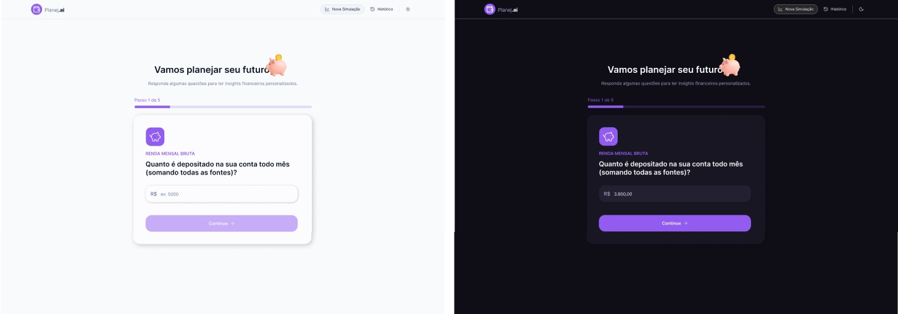
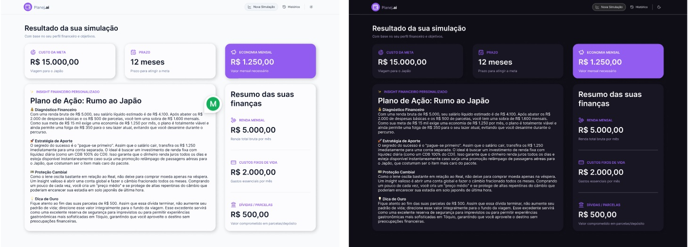
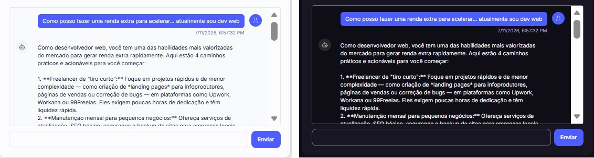
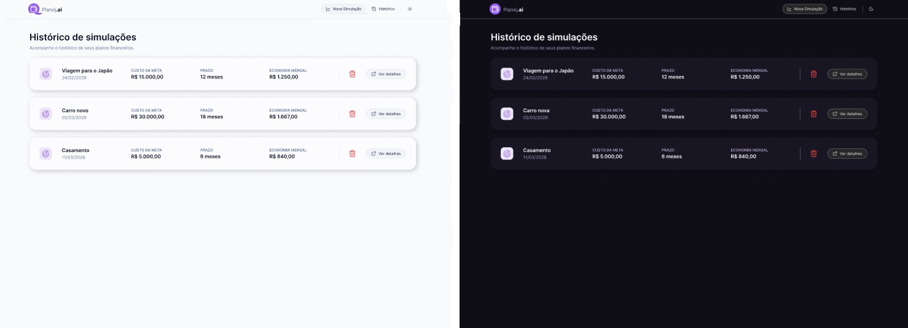
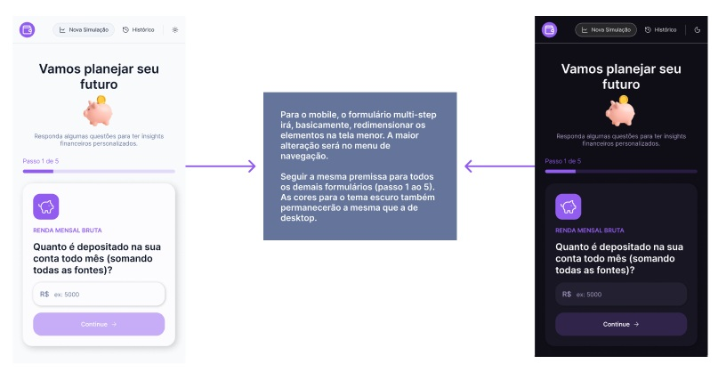
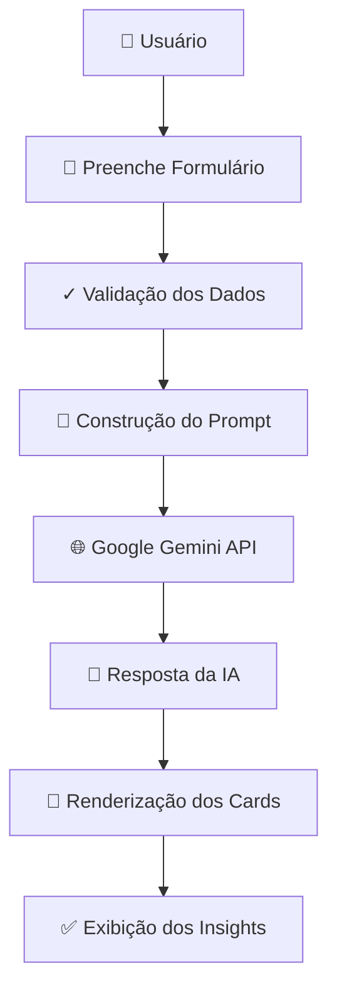

# 💰 Planej.ai

> Um educador financeiro inteligente que utiliza Inteligência Artificial para gerar diagnósticos financeiros personalizados, sugestões práticas e planos de ação com base na realidade financeira do usuário.

<p align="center">

**React 19 • TypeScript • Vite • Tailwind CSS v4 • Google Gemini**

</p>

---

## 📑 Índice

- [Sobre o Projeto](#-sobre-o-projeto)
- [Demonstração](#-demonstração)
- [Funcionalidades](#-funcionalidades)
- [Tecnologias](#-tecnologias)
- [Arquitetura](#-arquitetura)
- [Fluxo da Aplicação](#-fluxo-da-aplicação)
- [Como a IA Funciona](#-como-a-ia-funciona)
- [Decisões Técnicas](#-decisões-técnicas)
- [Como Executar](#-como-executar)
- [Variáveis de Ambiente](#-variáveis-de-ambiente)
- [Estrutura do Projeto](#-estrutura-do-projeto)
- [Melhorias Futuras](#-melhorias-futuras)
- [Roadmap](#-roadmap)
- [Diferenciais](#-diferenciais)

---

## 📖 Sobre o Projeto

O **Planej.ai** é uma aplicação web desenvolvida para auxiliar usuários no planejamento financeiro de forma simples e personalizada.

Através de um formulário intuitivo, o usuário informa:

- Sua renda mensal
- Suas despesas mensais
- Uma meta financeira (viagem, compra de carro, reserva de emergência, etc.)

Com esses dados, a aplicação constrói um prompt estruturado e o envia à API do **Google Gemini**, que gera uma análise personalizada contendo:

- 📊 Diagnóstico financeiro detalhado
- 💡 Sugestões práticas de economia
- 💰 Ideias de renda extra
- 📋 Plano de ação passo a passo
- 🎯 Recomendações personalizadas

**Sem backend, sem banco de dados remoto.** Toda a aplicação funciona diretamente no navegador, com dados armazenados no **LocalStorage**, permitindo que o usuário mantenha suas informações entre sessões.

---

## ✨ Demonstração

### 📝 Página Formulário Multi-step



### 🤖 Resultado com Insights da IA



### 💬 Chat Tira-dúvidas com IA



### ⏳ Página Histórico



### 📱 Visão Mobile



---

## 🚀 Funcionalidades

- ✅ Simulação financeira personalizada
- ✅ Cadastro de renda e despesas
- ✅ Definição de metas financeiras
- ✅ Geração de insights em tempo real com IA
- ✅ Sugestões práticas de economia
- ✅ Ideias de renda extra
- ✅ Plano de ação personalizado
- ✅ Persistência dos dados via LocalStorage
- ✅ Tema Claro / Escuro
- ✅ Interface Responsiva (Mobile First)

---

## 🛠 Tecnologias

### Frontend

- **React 19** — Biblioteca UI moderna
- **TypeScript** — Tipagem estática
- **Vite** — Build tool de alto desempenho
- **React Router DOM** — Roteamento client-side (SPA)
- **Tailwind CSS v4** — Utility-first CSS framework

### Inteligência Artificial

- **Google Gemini API** — Análise e geração de insights

### UI & Design

- **Lucide React** — Biblioteca de ícones SVG
- **React Loading Skeleton** — Componentes de carregamento
- **Fontsource Inter** — Fonte customizada auto-hospedada

### Ferramentas de Desenvolvimento

- **ESLint** — Linting de código
- **Prettier** — Formatação automática
- **Simple Import Sort** — Ordenação de imports
- **Unused Imports** — Remoção de imports não usados

---

## 🏛 Arquitetura

O projeto segue o princípio de **separação de responsabilidades**, facilitando manutenção, escalabilidade e reutilização de código.

| Pasta          | Responsabilidade                                           |
| -------------- | ---------------------------------------------------------- |
| **components** | Componentes reutilizáveis e específicos de funcionalidades |
| **pages**      | Páginas da aplicação                                       |
| **hooks**      | Lógica de negócio reutilizável (custom hooks)              |
| **services**   | Integração e chamadas a APIs                               |
| **context**    | Estado global (tema, configurações)                        |
| **utils**      | Funções auxiliares e utilitários                           |
| **data**       | Dados estáticos e construção de prompts                    |
| **styles**     | Variáveis de tema e estilos globais                        |

---

## 📂 Estrutura do Projeto

```text
src/
├── assets/
│   └── images/
│       └── piggy-bank.png
├── components/
│   ├── features/
│   │   ├── Insights/
│   │   ├── Simulation/
│   │   └── SimulationResults/
│   ├── layout/
│   │   └── RootLayout.tsx
│   └── shared/
│       ├── Button.tsx
│       ├── Header.tsx
│       ├── Input.tsx
│       └── PageHero.tsx
├── context/
│   └── theme/
│       ├── ThemeContext.tsx
│       └── ThemeProvider.tsx
├── data/
│   ├── aiPrompt.ts
│   └── simulation.ts
├── hooks/
│   ├── useInsight.tsx
│   ├── useSimulationStorage.tsx
│   └── useTheme.tsx
├── pages/
│   ├── SimulationFormPage.tsx
│   └── SimulationResultsPage.tsx
├── services/
│   └── aiService.ts
├── styles/
│   └── theme.css
├── utils/
│   ├── currency.ts
│   └── simulation.ts
├── App.tsx
├── index.css
├── main.tsx
└── router.tsx
```

---

## 🔄 Fluxo da Aplicação



---

## 🤖 Como a IA Funciona

O Planej.ai utiliza a **API do Google Gemini** para gerar análises personalizadas em tempo real.

### Processo de Geração de Insights:

1. **Coleta de dados** — Usuário preenche o formulário com renda, despesas e meta
2. **Validação** — Dados são validados antes de serem processados
3. **Prompt Builder** — Dados são transformados em um prompt estruturado
4. **Chamada à IA** — Prompt é enviado à API do Google Gemini
5. **Parsing** — Resposta é processada e estruturada
6. **Renderização** — Insights são exibidos em cards interativos

**Toda essa comunicação acontece em tempo real**, sem intermediários, diretamente no navegador do usuário.

---

## 💡 Decisões Técnicas

### React 19

Escolhido por oferecer uma base sólida e moderna para construção de interfaces, com suporte a server components e performance otimizada.

### TypeScript

Aumenta significativamente a segurança do código e reduz erros em tempo de desenvolvimento através de tipagem estática rigorosa.

### Vite

Oferece velocidade excepcional tanto em desenvolvimento quanto na build, com Hot Module Replacement (HMR) praticamente instantâneo.

### Tailwind CSS v4

Framework de CSS utilitário que acelera prototipagem e garante consistência visual sem necessidade de escrever CSS customizado.

### Hooks Customizados

Toda lógica de negócio foi isolada em custom hooks (`useInsight`, `useSimulationStorage`, `useTheme`), mantendo componentes simples e focados apenas em UI.

### LocalStorage para Persistência

Eliminou a necessidade de backend durante o MVP, permitindo que a aplicação funcione completamente offline e reduzindo custos de infraestrutura.

### Context API

Escolhida para gerenciamento de estado simples (tema) por ser nativa do React e não adicionar complexidade desnecessária.

---

## ⚙️ Como Executar

### Pré-requisitos

- Node.js 18+
- npm ou yarn

### Instalação

```bash
# Clone o repositório
git clone https://github.com/uchoacarlos22/educador-financeiro-inteligente.git

# Entre na pasta
cd planej-ai

# Instale as dependências
npm install
```

### Configuração de Variáveis de Ambiente

Crie um arquivo `.env` na raiz do projeto:

```env
VITE_GEMINI_API_KEY=SUA_CHAVE_DO_GEMINI
```

> Obtenha sua chave em: https://ai.google.dev/

### Execução

```bash
# Inicie o servidor de desenvolvimento
npm run dev
```

A aplicação estará disponível em `http://localhost:5173`

### Build para Produção

```bash
# Gera os arquivos otimizados em /dist
npm run build

# Preview da build
npm run preview
```

---

## 🔐 Variáveis de Ambiente

| Variável              | Descrição                     | Origem                                     |
| --------------------- | ----------------------------- | ------------------------------------------ |
| `VITE_GEMINI_API_KEY` | Chave da API do Google Gemini | [Google AI Studio](https://ai.google.dev/) |

**⚠️ Nunca compartilhe sua chave de API publicamente!**

---

## 🎨 Design

O layout foi prototipado no Figma seguindo princípios de design system e mobile-first.

[Visualizar Design no Figma](https://www.figma.com/design/MVZhmZxoVAsgotZo50gj6M/Educador-Financeiro---DIO)

---

## 📌 Melhorias Futuras

- [ ] React Hook Form + Zod (validação robusta)
- [ ] React Query (gerenciamento de estado de servidor)
- [ ] Testes Unitários (Jest + Testing Library)
- [ ] Testes de Integração
- [ ] Testes E2E (Playwright)
- [ ] Exportação em PDF dos resultados
- [ ] Histórico de simulações
- [ ] Dashboard financeiro avançado
- [ ] Sistema de login / autenticação
- [ ] Persistência em banco de dados (Supabase)
- [ ] Integração com Open Finance
- [ ] PWA (Progressive Web App)
- [ ] Analytics (Google Analytics 4)
- [ ] Otimizações de performance

---

## 🗺 Roadmap

| Status | Funcionalidade                    |
| ------ | --------------------------------- |
| ✅     | Simulação Financeira Básica       |
| ✅     | Integração com Google Gemini      |
| ✅     | Tema Claro / Escuro               |
| ✅     | Responsividade Mobile             |
| ✅     | Persistência Local (LocalStorage) |
| ⏳     | Histórico de Simulações           |
| ⏳     | Autenticação de Usuário           |
| ⏳     | Dashboard com Gráficos            |
| ⏳     | Exportação em PDF                 |
| ⏳     | Integração Open Finance           |
| 🔮     | Recomendações de Investimentos    |
| 🔮     | Simulador de Amortização          |

---

## 📈 Diferenciais

Este projeto demonstra domínio em várias áreas:

- **Arquitetura Modular** — Separação clara de responsabilidades e componentes reutilizáveis
- **Componentização Pensada** — Cada componente tem uma responsabilidade única e bem definida
- **Custom Hooks** — Abstração de lógica complexa em hooks reutilizáveis
- **Integração com IA Generativa** — Uso prático de LLMs em produção
- **Tipagem Completa** — TypeScript aplicado em todo o codebase
- **Design Responsivo** — Mobile-first, funciona perfeitamente em qualquer dispositivo
- **Tema Claro/Escuro** — Implementação elegante com CSS variables
- **Persistência Local** — Sem dependência de backend durante o MVP
- **Código Limpo** — Formatação automática e linting configurado
- **Boas Práticas** — Padrões modernos de desenvolvimento React

---

## 🎓 Aprendizados Principais

Este projeto foi uma excelente oportunidade para aprofundar:

1. **Integração com LLMs** — Como estruturar prompts e processar respostas de APIs de IA
2. **State Management com React** — Uso de Context API, useState e localStorage
3. **Componentes Reutilizáveis** — Design de componentes que escalam
4. **Tipagem TypeScript** — Aproveitamento máximo de type safety
5. **CSS Moderno** — Tailwind v4 e CSS variables para temas
6. **UX/DX** — Formulários intuitivos e feedback visual instantâneo

---

## 🚀 Possíveis Evoluções de Arquitetura

Se este projeto evoluísse para **produção em larga escala**, a arquitetura seria transformada assim:

```
Backend:
├── Node.js / Express
├── Autenticação JWT
├── Banco de dados (PostgreSQL)
├── Cache (Redis)
└── Fila de processamento (Bull)

Frontend:
├── React Query para gerenciamento de servidor state
├── React Hook Form + Zod para validação
├── MSW (Mock Service Worker) para testes
├── Storybook para documentação de componentes
└── Vitest para testes unitários

Infraestrutura:
├── CI/CD (GitHub Actions)
├── Docker + Kubernetes
├── Observabilidade (Sentry, DataDog)
└── CDN para assets estáticos
```

---

## 👨‍💻 Autor

**Carlos Uchoa**

Engenheiro de Software Frontend especializado em React, Angular e TypeScript.

- 🔗 [GitHub](https://github.com/uchoacarlos22)
- 💼 [LinkedIn](https://www.linkedin.com/in/carlos-uchoa-da-silva-51911511b/)

---

## 📄 Licença

Este projeto foi desenvolvido para fins educacionais como parte do desafio da DIO.

---

## 🙏 Agradecimentos

- [Google Gemini API](https://ai.google.dev/) — Por fornecer a API de IA
- [DIO](https://www.dio.me/) — Pela plataforma de aprendizado e desafio
- [React Community](https://react.dev/) — Pela excelente documentação
